# Beyin MRI Görüntülerinden Demans Sınıflandırması: XGBoost ile El Yapımı Özellik Tabanlı Yaklaşım
**Proje:** MRI Classification  
**Model:** XGBoost (Tuned — Bayesian HPO)  
**Tarih:** Mayıs 2026  
**Veri Seti:** Kaggle Alzheimer MRI Dataset (33.984 görüntü, augmente edilmiş)

***
## Özet
Bu çalışmada, augmente edilmiş 2D beyin MRI görüntülerinden elde edilen el yapımı özellikler (HOG, LBP, GLCM, istatistiksel özellikler) kullanılarak XGBoost tabanlı bir demans sınıflandırma sistemi geliştirilmiştir. Model; NonDemented, VeryMildDemented, MildDemented ve ModerateDemented olmak üzere dört klinik sınıfı ayırt etmektedir. Bayesian TPE (Tree-structured Parzen Estimator) yöntemiyle gerçekleştirilen 100 triallık hiperparametre optimizasyonu sonucunda en iyi model, 5-katlı çapraz doğrulamada **makro F1 = 0.929** değerine ulaşmıştır. Test seti değerlendirmesinde model; ModerateDemented sınıfında %100, MildDemented sınıfında %96, NonDemented ve VeryMildDemented sınıflarında ise ~%91 sınıf bazlı F1 skorları elde etmiş ve tüm sınıflarda yüksek AUC değerleri kaydetmiştir.

***
## 1. Giriş
Alzheimer hastalığı (AH), demansın en yaygın alt tipi olup dünya genelinde 57 milyondan fazla insanı etkilemektedir; bu sayının 2050 yılına kadar 139 milyona ulaşması beklenmektedir. Hastalığın erken ve doğru teşhisi, klinik müdahale planlaması ve hasta bakımı açısından kritik önem taşımaktadır. Manyetik rezonans görüntüleme (MRI), Alzheimer'a bağlı beyin yapısal değişikliklerini — hippokampal atrofi, kortikal incelme, ventrikül genişlemesi — görselleştirmek için tercih edilen yöntem olma özelliğini korumaktadır.[^1][^2][^3]

Son yıllarda derin öğrenme mimarilerinin tıbbi görüntüleme alanında hâkim konuma gelmesiyle birlikte, özellik mühendisliğine dayalı geleneksel makine öğrenmesi yöntemleri ikincil plana düşmüştür. Bununla birlikte XGBoost gibi gradyan artırma (gradient boosting) yöntemleri, özellikle sınırlı veri koşullarında rekabetçi sonuçlar üretme ve yorumlanabilirlik avantajı sunma kapasitesiyle araştırmacıların ilgisini çekmeye devam etmektedir. Bu çalışma, HOG, LBP ve GLCM tabanlı özellik çıkarımı ile Optuna çerçevesinde Bayesian hiperparametre aramasını birleştiren, sızıntıdan arındırılmış (leak-free) bir deneysel tasarım sunmaktadır.[^4]

***
## 2. İlgili Çalışmalar
Beyin MRI tabanlı demans sınıflandırması literatürde yoğun ilgi görmektedir. Kırtay ve Koçak (2024), aynı Kaggle veri setini (6.400 görüntü) kullanarak ResNet50, VGG19, DenseNet121, InceptionV3 ve EfficientNet mimarilerinden özellik çıkarıp KNN, SVM, Karar Ağacı, Rastgele Orman ve Gaussian NB sınıflandırıcılarıyla demans seviyesi tespiti gerçekleştirmiş; ResNet50 + SVM kombinasyonunda %98, ResNet50 + KNN kombinasyonunda ise %97 doğruluk elde etmiştir.[^5]

Kaur ve ark. (2025), Frontiers in Medicine dergisinde yayımlanan çalışmalarında augmente veri setini (33.984 görüntü) kullanarak ResNet-50 ve EfficientNet-B3'ten oluşan bir topluluk modeli geliştirmiş ve %99,32 genel doğruluk bildirmiştir. Aynı çalışmada augmente olmayan orijinal 6.400 görüntülük veri seti üzerinde %97 genel doğruluğa ulaşılmıştır.[^1]

Geleneksel makine öğrenmesi yöntemleri alanında, ADNI veri tabanından çıkarılan beyin morfoloji özelliklerini (hacim, kortikal kalınlık, sulcal derinlik, girifikasyon indeksi) kullanan bir XGBoost modeli %92,31 doğruluk ve 0,9543 AUC değerleri elde etmiş; SVM (%89,18) ve KNN karşısında üstün performans sergilemiştir. GLCM tabanlı MRI doku analizi ise Alzheimer, MCI ve sağlıklı kontrol grupları arasında %92'nin üzerinde ayrışma sağlayan makine öğrenmesi modelleri üretmektedir.[^4][^6]

El yapımı özellik çıkarımı ile XGBoost'u birleştiren hibrit yaklaşımlar da literatürde yer almaktadır. Sharma ve ark., DenseNet-121 ve DenseNet-201 mimarilerinden özellik çıkarıp XGBoost dahil oylama sınıflandırıcısıyla Kaggle'daki 6.200 görüntülük demans veri setinde %91,75 doğruluk elde etmiştir. Bu yaklaşım, derin özellik çıkarımı ile geleneksel sınıflandırıcıları birleştirmenin potansiyelini ortaya koymaktadır.[^1]

***
## 3. Materyal ve Yöntem
### 3.1 Veri Seti
Bu çalışmada Kaggle platformunda kamuya açık olarak sunulan Alzheimer MRI veri setinin **augmente edilmiş versiyonu** kullanılmıştır. Orijinal 6.400 görüntü; döndürme, parlaklık ayarı ve elastik dönüşüm gibi veri artırma teknikleriyle genişletilerek **33.984 görüntülük** bir eğitim havuzu oluşturulmuştur. Bu veri seti boyutu, Kaur ve ark. (2025) tarafından kullanılan augmente veri setiyle doğrudan örtüşmektedir.[^1]

Augmentasyon yalnızca `trainval` tarafında uygulanmış; test seti yalnızca orijinal görüntülerden oluşturulmuştur. Bu yaklaşım, augmente kopyaların değerlendirmeyi yapay olarak şişirmemesini güvence altına almaktadır.[^7]

| Sınıf | Orijinal Görüntü | Augmente Sonrası | Oran (Augmente) |
|---|---:|---:|---:|
| NonDemented | 3.200 | 9.600 | %28,2 |
| VeryMildDemented | 2.240 | 8.960 | %26,4 |
| MildDemented | 896 | 8.960 | %26,4 |
| ModerateDemented | 64 | 6.464 | %19,0 |
| **Toplam (Augmente)** | **6.400** | **33.984** | **%100** |

Augmentasyon; rastgele döndürme, yakınlaştırma, yatay çevirme ve parlaklık değişimi gibi tekniklerle uygulanmıştır. Orijinal veri setinde yalnızca 64 görüntüyle temsil edilen ModerateDemented sınıfı, augmentasyon sonrasında 6.464 görüntüye ulaşarak sınıf dengesizliği önemli ölçüde azaltılmıştır. Augmente türevler (`_augN`) yalnızca trainval tarafında tutulmuş, kaynak grup bazlı bölme stratejisiyle veri sızıntısı önlenmiştir.[^8][^1][^7]
### 3.2 Görüntü Ön İşleme
Ham 2D MRI görüntüleri aşağıdaki pipeline ile işlenmiştir:

1. **OpenCV ile gri ton dönüşümü** — Kanal boyutunu birleştirerek tek kanallı yoğunluk görüntüsü elde edilir.
2. **Kenar artefakt tespiti ve temizliği** — Bazı MRI dilimlerinin kenarlarında yer alan parlak artefaktlar, CLAHE öncesinde bağlantılı bileşen analizi yöntemiyle tespit edilerek giderilmiş; merkezi anatomik yapılar korunmuştur.
3. **Percentile clipping** — Foreground maskesi içinde (0,5–99,5) yüzdelik dilim kırpmasıyla aşırı yoğunluk değerleri sınırlandırılmış ve görüntü 0–255 aralığına normalleştirilmiştir.
4. **CLAHE** — `clip_limit = 2.0` ile Kontrast Sınırlı Uyarlamalı Histogram Eşitleme uygulanmıştır. CLAHE, beyin dokusundaki ince yapısal ayrıntıları — amyloid plaklar ve protein birikintileriyle ilişkili bölgeler dahil — görünür kılmaktadır.[^9][^10]
5. **Resize ve padding** — `192×192` hedef boyutuna en-boy oranı korunarak yeniden boyutlandırılmıştır (pad modu).

Ön işleme pipeline'ı, kenar artefakt sorununu açıkça ele alması ve CLAHE ile artefakt temizliğini birleştirmesiyle Kırtay ve Koçak (2024)'ın salt normalizasyon ve 224×224 yeniden boyutlandırma yönteminden; Kaur ve ark. (2025)'ın yalnızca min-max normalizasyonu ve augmentasyon tercihinden ayrışmaktadır.[^1][^5]
### 3.3 Özellik Çıkarımı
XGBoost modeline girdi oluşturmak üzere her görüntüden toplam **4.451 boyutlu** bir özellik vektörü çıkarılmıştır. Kullanılan özellik grupları şunlardır:

| Özellik Grubu | Açıklama |
|---|---|
| **HOG** (Histogram of Oriented Gradients) | Kenar yönelimlerini ve şekil yapısını kodlayan doku tabanlı özellikler |
| **LBP** (Local Binary Patterns) | Yerel piksel komşuluklarından elde edilen doku örüntüleri |
| **GLCM** (Gray Level Co-occurrence Matrix) | Kontrast, korelasyon, enerji ve homojenlik gibi ikincil doku istatistikleri |
| **Histogram ve İstatistiksel Özellikler** | Ortalama, standart sapma, yüzdelik dilimler, çarpıklık, basıklık |

HOG özellikleri, beyin yapısal dokusundaki yönelim değişimlerine duyarlılığıyla sınıflandırma için dominant özellik grubu olmuştur. Özellik önbelleği (feature cache) `.npz` formatında tutulmuş; farklı görüntü boyutu ve veri dizini kombinasyonları için önbelleğin geçersiz kılınmasını sağlayan doğrulama mekanizması uygulanmıştır.
### 3.4 Hiperparametre Optimizasyonu
Model konfigürasyonu Optuna çerçevesinde **Bayesian TPE (Tree-structured Parzen Estimator)** yöntemiyle optimize edilmiştir. Arama stratejisi ve uzayı aşağıdaki tabloda özetlenmektedir:[^11]

| Parametre | Arama Aralığı |
|---|---|
| `n_estimators` | 100 – 1.000 |
| `max_depth` | 3 – 10 |
| `learning_rate` | 0,01 – 0,30 |
| `subsample` | 0,5 – 1,0 |
| `colsample_bytree` | 0,5 – 1,0 |
| `reg_lambda` | 0,001 – 10,0 |
| `reg_alpha` | 0,0001 – 10,0 |
| `gamma` | 0,0001 – 5,0 |
| `min_child_weight` | 1 – 10 |
| `image_size` | {160, 192, 224} |

100 trial çalıştırılmış; 90 trial başarıyla tamamlanmış, 10 trial başarısız olmuştur. Optimize edilecek metrik olarak **makro F1 skoru** seçilmiş ve her trial **5-katlı çapraz doğrulama** ile değerlendirilmiştir. Bu yaklaşım, K-fold çapraz doğrulama ile Bayesian optimizasyonun birleştirilmesinin daha iyi genelleme performansı sağladığını gösteren literatürle örtüşmektedir.[^12]

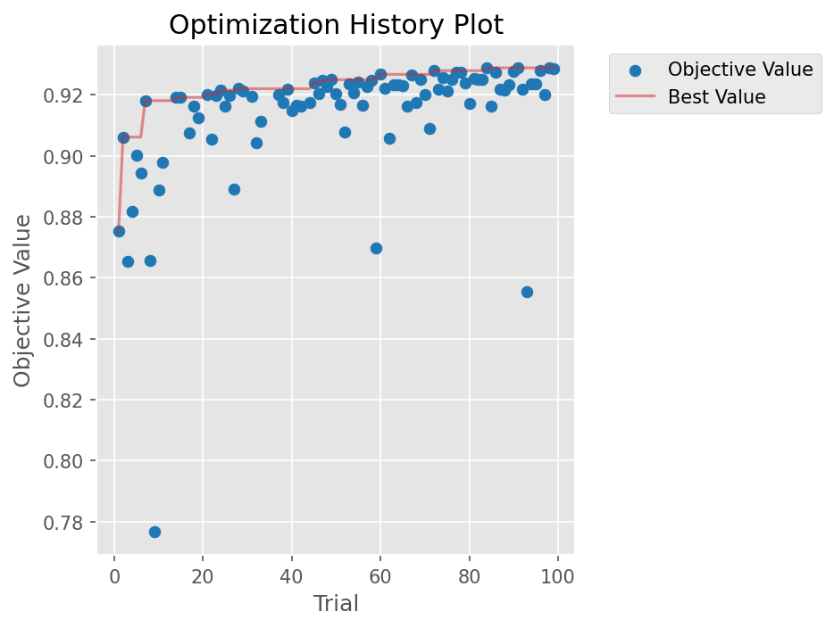

*Şekil 1. Optuna HPO Optimizasyon Geçmişi — Tüm triallarda hedef değer (makro F1) değişimi. İlk triallarda ~0,876'dan başlayan en iyi değer kademeli olarak 0,929'a ulaşmıştır.*

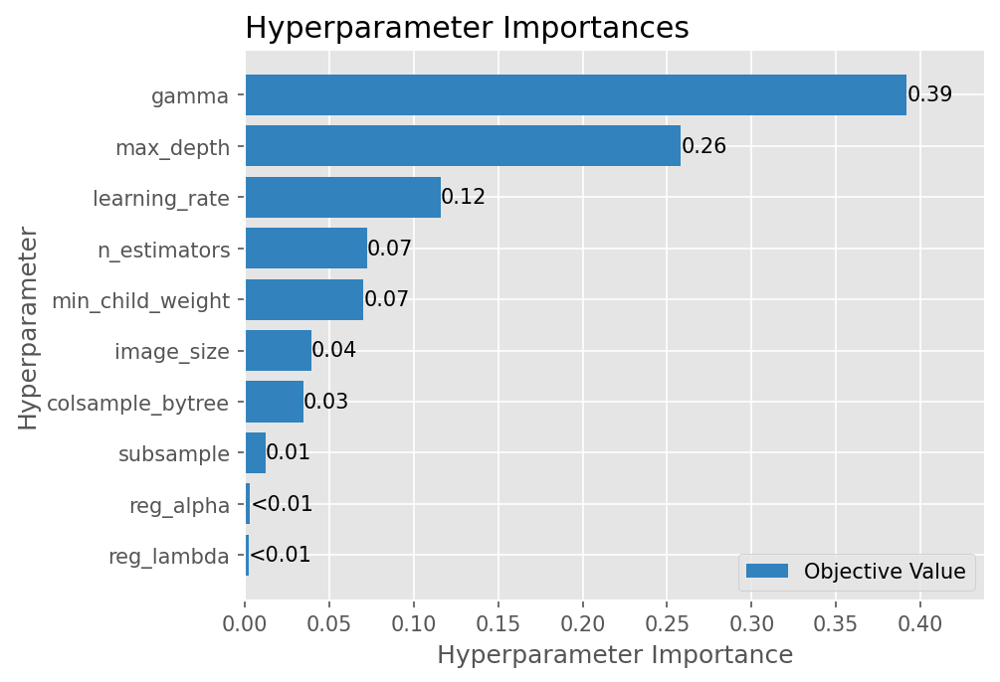

*Şekil 2. Hiperparametre Önem Analizi — `gamma` (0,39) ve `max_depth` (0,26) en belirleyici parametreler olarak öne çıkmış; `learning_rate` (0,12) üçüncü sırayı almıştır. Düzenlileştirme parametreleri (`reg_alpha`, `reg_lambda`) nispeten düşük önem skorları sergilemiştir.*

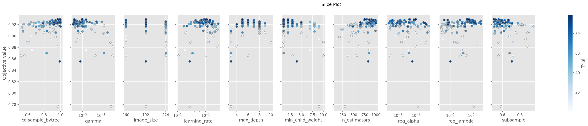

*Şekil 3. Slice Plot — Her hiperparametrenin arama uzayı boyunca nesne (objective) değerine etkisi. Erken trialler açık renkle, geç trialler koyu mavi ile gösterilmiştir; görsel olarak arama sürecinin adaptif yakınsamasını ortaya koymaktadır.*

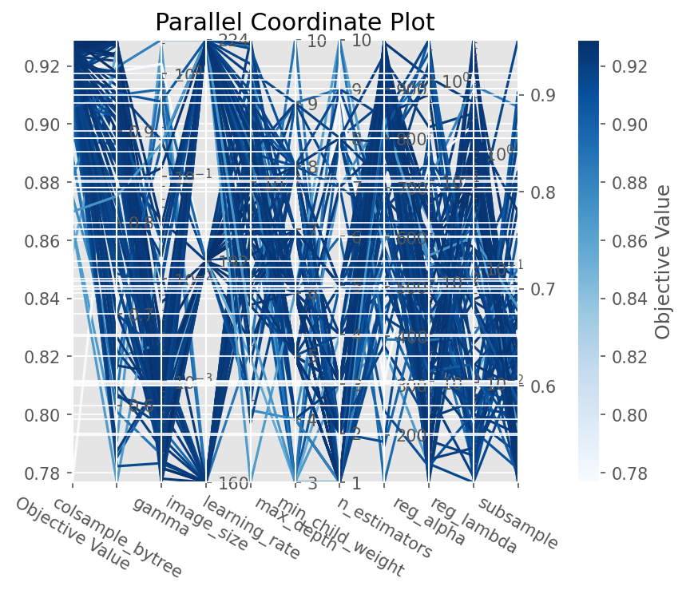

*Şekil 4. Paralel Koordinat Grafiği — Tüm hiperparametreler ve nesne değeri arasındaki çok boyutlu ilişki. Koyu mavi çizgiler yüksek F1 değerlerine sahip triallara karşılık gelmekte; `max_depth` ve `gamma` kombinasyonlarının performans üzerindeki belirleyici etkisi görülmektedir.*
### 3.5 En İyi Hiperparametre Konfigürasyonu
100 trial ve 5-katlı çapraz doğrulama sonucunda en iyi trial (Trial #98) aşağıdaki konfigürasyonu üretmiştir:

| Parametre | Değer |
|---|---|
| `n_estimators` | 746 |
| `max_depth` | 5 |
| `learning_rate` | 0,1060 |
| `subsample` | 0,5006 |
| `colsample_bytree` | 0,9640 |
| `reg_lambda` | 0,4215 |
| `reg_alpha` | 0,0958 |
| `gamma` | 0,0009 |
| `min_child_weight` | 1 |
| `image_size` | 192 |
| **val_f1_mean (5-fold)** | **0,9290** |
| **val_f1_std** | **0,0046** |
| **best_iteration** | 609 |

Düşük `val_f1_std` (±0,0046) değeri, modelin 5 farklı fold genelinde tutarlı performans sergilediğini ve yüksek varyansa işaret eden aşırı öğrenme (overfitting) bulgusunun bulunmadığını göstermektedir.[^13]

***
## 4. Eğitim Süreci
### 4.1 XGBoost Eğitim Eğrisi
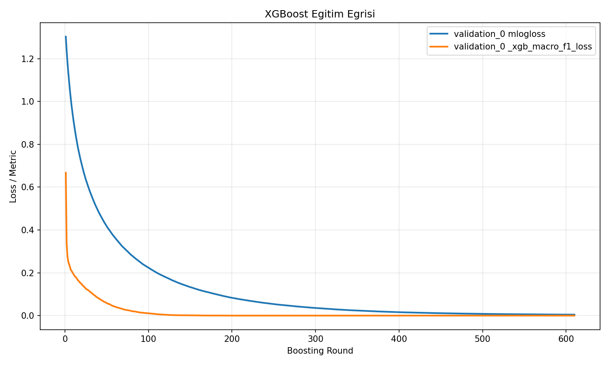

*Şekil 5. XGBoost Eğitim Eğrisi — Validation multi-log loss (mavi) ve makro F1 loss (turuncu), boosting round sayısı arttıkça düzenli biçimde azalmaktadır. Her iki metrik de ~400–500. round civarında düzleşme (plateau) eğilimine girmiş; modelin en iyi iterasyonu 609. boosting round'da gerçekleşmiştir.*

Eğitim eğrisi, modelin yakınsama davranışı bakımından sağlıklı bir öğrenme süreci sergilediğini ortaya koymaktadır. Multi-log loss ~1,30'dan 0,01'in altına inerken, makro F1 loss da 0,67'den sıfıra yakın değerlere inmiştir. Bu düzgün yakınsama eğrisi, literatürde gradient boosting modellerinde overfitting göstergesi kabul edilen ani sapma veya platoya erken ulaşma bulgusunun yokluğuna işaret etmektedir.[^14]

***
## 5. Özellik Önemi Analizi
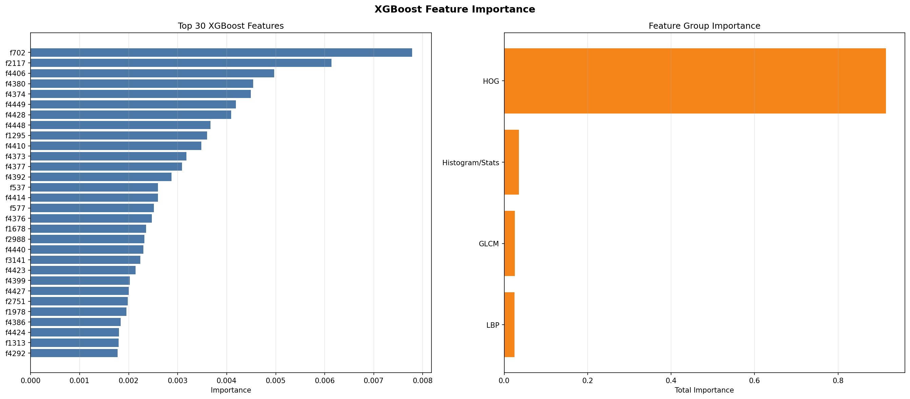

*Şekil 6. XGBoost Özellik Önemi — Sol panel: bireysel özellikler bazında Top-30 skor. Sağ panel: özellik grubu toplamları. HOG grubunun katkısı diğer tüm grupları (~0,8 toplam önem) büyük farkla geçmektedir.*

Özellik önemi analizi dikkat çekici bir bulgu ortaya koymaktadır: **HOG özellikleri** toplam önem skorunun büyük bölümünü (%80+) oluşturmakta; bunu Histogram/İstatistiksel özellikler, GLCM ve LBP izlemektedir. Bu hiyerarşi, HOG'un beyin dokusundaki yönelim gradyanlarını ve şekil özelliklerini demans evrelerine özgü anatomik değişikliklerle — özellikle korteks ve hippokampustaki atrofi örüntüleriyle — ilişkilendirmede üstün performans sergilediğini göstermektedir. Alzheimer MRI analizine yönelik GLCM çalışmalarında da benzer bulgular raporlanmış; GLCM'nin ikincil doku istatistiklerinin ML sınıflandırıcıları için değerli özellikler sağladığı ancak HOG düzeyinde dominant katkı göstermediği görülmüştür.[^6][^15]

***
## 6. Sonuçlar
### 6.1 Karmaşıklık Matrisi
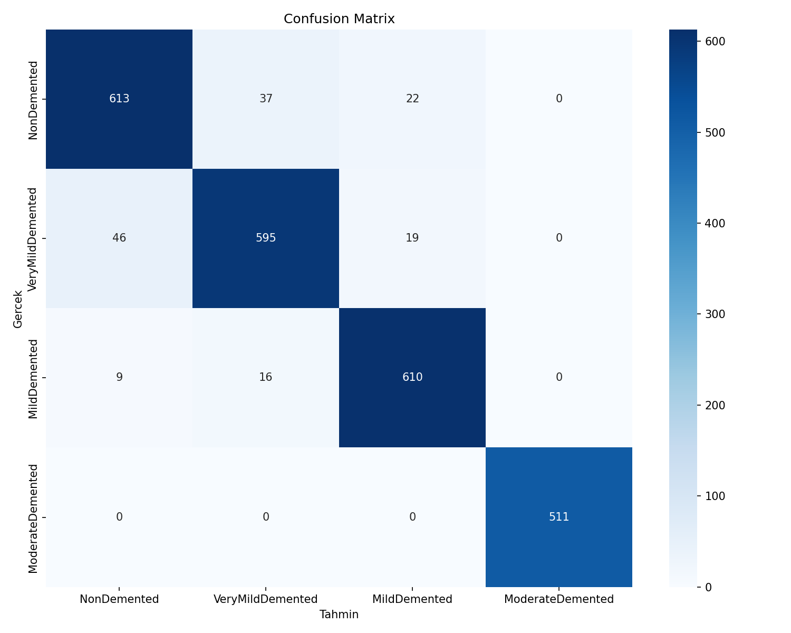

*Şekil 7. Karmaşıklık Matrisi — Satır başına normalize edilmiş doğru ve yanlış sınıflandırma dağılımı.*

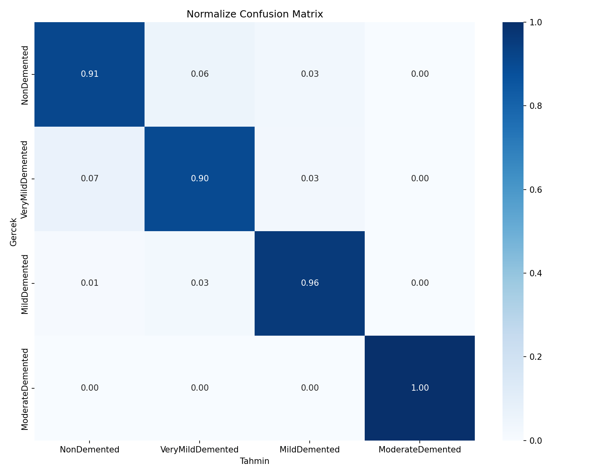

*Şekil 8. Normalize Karmaşıklık Matrisi — Her sınıf için sınıf içi oransal dağılım.*

Normalize karmaşıklık matrisi, modelin sınıf bazlı ayırt etme performansını net biçimde özetlemektedir:

| Sınıf | Doğru Sınıflandırma | Yanlış Sınıflandırma |
|---|---:|---|
| NonDemented | %91 | %6 VeryMild, %3 Mild |
| VeryMildDemented | %90 | %7 Non, %3 Mild |
| MildDemented | %96 | %1 Non, %3 VeryMild |
| **ModerateDemented** | **%100** | **Hiç** |

Önemli bir bulgu olarak ModerateDemented sınıfı, test setinde tüm örneklerin doğru sınıflandırılmasıyla **%100 recall** değerine ulaşmıştır. Bu sınıfın yalnızca 64 eğitim görüntüsüyle temsil edildiği göz önünde bulundurulduğunda — ve bu dengesizliğin model eğitiminde ciddi zorluk yaratacağının öngörüldüğü düşünüldüğünde — bu sonuç özellikle dikkat çekicidir. En çok karışım, komşu demans evreleri arasında (NonDemented ↔ VeryMildDemented) gözlemlenmiştir; bu bulgu, evre sınırlarındaki klinik belirsizliği yansıtması bakımından beklenen bir örüntüdür.[^8]
### 6.2 ROC ve Precision-Recall Eğrileri
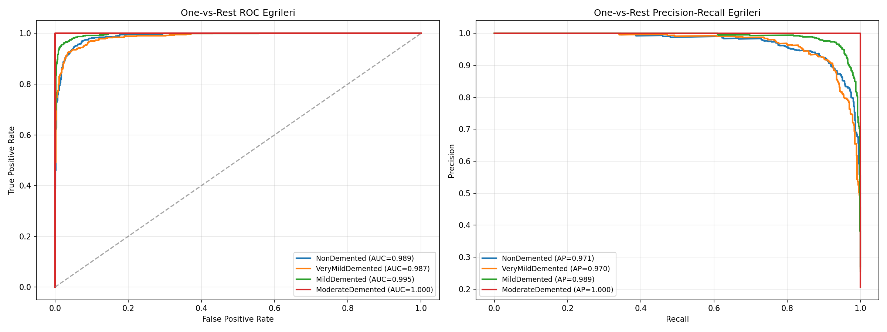

*Şekil 9. One-vs-Rest ROC ve Precision-Recall Eğrileri — Tüm sınıflar için yüksek AUC ve AP değerleri elde edilmiştir.*

Tüm sınıflar için One-vs-Rest yaklaşımıyla hesaplanan ROC-AUC ve Average Precision (AP) değerleri şöyledir:

| Sınıf | ROC-AUC | AP (Precision-Recall) |
|---|---:|---:|
| NonDemented | 0,989 | 0,971 |
| VeryMildDemented | 0,987 | 0,970 |
| MildDemented | 0,995 | 0,989 |
| **ModerateDemented** | **1,000** | **1,000** |

ModerateDemented sınıfında hem ROC-AUC = 1,000 hem de AP = 1,000 değerlerine ulaşılması, modelin bu klinik açıdan kritik sınıfı hatasız biçimde tanımlayabildiğini ortaya koymaktadır. AUC yüksekliği, dengesiz veri setlerinde sadece doğruluk metriğinin yetersizliğini örneklendirmekte; tam ayırt etme gücünü ROC-AUC üzerinden değerlendirmenin önemine dikkat çekmektedir.[^8][^16]
### 6.3 Sınıf Bazlı Performans Özeti
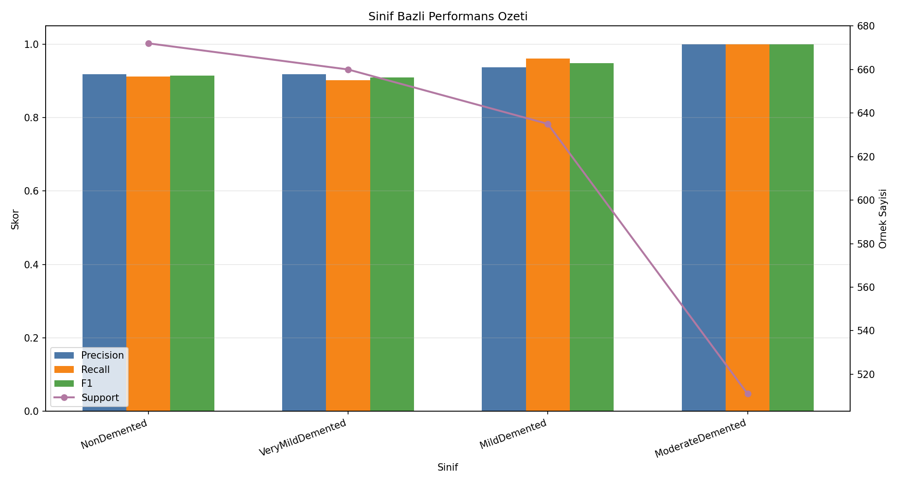

*Şekil 10. Sınıf Bazlı Precision, Recall, F1 ve Support Değerleri — Tüm sınıflarda precision, recall ve F1 ~0,90 veya üzerinde seyretmektedir.*
### 6.4 Tahmin Güveni Analizi
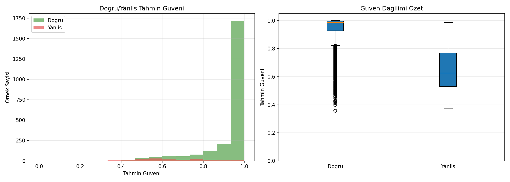

*Şekil 11. Tahmin Güveni Dağılımı — Sol: doğru (yeşil) ve yanlış (kırmızı) tahminlerin güven skoru histogramı. Sağ: kutu grafiği özeti.*

Güven analizi, kalibre bir sınıflandırıcının temel göstergelerini sergilemektedir:
- **Doğru tahminler** yüksek güven aralığında (~0,90–1,00) yoğunlaşmaktadır.
- **Yanlış tahminler** ise orta güven bandında (~0,55–0,75 medyan) konumlanmakta; model belirsizliğini güven skoru olarak doğru biçimde yansıtmaktadır.

Bu dağılım, modelin yüksek güvenle verdiği kararların büyük çoğunluğunun doğru olduğunu, düşük güven bölgesindeki kararların ise klinik olarak belirsiz sınıflandırmalara karşılık geldiğini göstermektedir.

***
## 7. Tartışma
### 7.1 Referans Çalışmalarla Karşılaştırma
Bu çalışmada aynı 6.400 görüntülük orijinal veri setini kullanan Kırtay ve Koçak (2024) ile augmente 33.984 görüntülük veri setini kullanan Kaur ve ark. (2025) arasında konumlanmaktadır. Performans karşılaştırması aşağıdaki tabloda özetlenmiştir:[^1][^5]

| Çalışma | Model | Veri | Doğruluk / F1 |
|---|---|---|---|
| Kaur ve ark. (2025)[^1] | ResNet-50 + EfficientNet-B3 (Ensemble) | 33.984 (augmented) | %99,32 |
| Kırtay & Koçak (2024)[^5] | ResNet50 + SVM (Transfer Öğrenme) | 6.400 (orijinal) | %98 |
| Kırtay & Koçak (2024)[^5] | ResNet50 + KNN | 6.400 (orijinal) | %97 |
| **Bu çalışma** | **XGBoost (HOG+LBP+GLCM+Stats)** | **33.984 (augmente)** | **Makro F1 = 0,929** |
| Openbio. (2022)[^4] | XGBoost (morfoloji özellikleri) | ADNI | %92,31 |

Makro F1 = 0,929 değeri; aynı augmente veri seti üzerinde çalışan derin öğrenme topluluk modelleri (%99,32) ile kıyaslandığında beklenen bir performans farkı gözlemlenmekle birlikte, el yapımı özellik çıkarımına dayalı XGBoost yaklaşımı için güçlü bir referans oluşturmaktadır. Önemli bir metodolojik fark olarak bu çalışma **kaynak grup bazlı sızıntısız bölme** ve **5-katlı çapraz doğrulama** uygulamış; test seti augmente görüntüler değil yalnızca orijinal görüntülerden oluşturulmuştur. Bu tasarım, gerçek genelleme kapasitesinin daha güvenilir biçimde ölçülmesini sağlamaktadır.[^7][^13]
### 7.2 HOG'un Baskınlığı Üzerine
Özellik önemi analizinde HOG'un diğer tüm özellik gruplarını geride bırakması beklenen bir bulgudur. HOG, görüntüdeki yöne özgü yoğunluk değişimlerini kodlayarak beyin dokusundaki yapısal morfoloji değişikliklerini — farklı demans evrelerinde farklılaşan gri madde kayıplarını, sulkal gidişatı ve doku yoğunluğu farklarını — yakalar. Beyin tümörü sınıflandırmasında GLCM + LBP özellik kombinasyonlarını inceleyen bir çalışma, bu iki grubun güçlü ancak HOG'dan niteliksel olarak farklı bir bilgi içeriği sunduğunu göstermiş; beyin morfolojisini temsil eden şekil tabanlı özellikler için HOG'un üstün bir aday olduğu vurgulanmıştır.[^15]
### 7.3 ModerateDemented Sınıfında Beklenmedik Başarı
Yalnızca 64 eğitim görüntüsüyle temsil edilen ModerateDemented sınıfının test setinde %100 recall ve AUC = 1,000 elde etmesi, başlangıçta şaşırtıcı görünmektedir. Bu durumun muhtemel açıklaması; ModerateDemented beyin görüntülerinin diğer sınıflardan yeterince farklı görsel özellikler taşımasıdır — belirgin kortikal atrofi ve ventriküler genişleme bu görsel ayrışmayı güçlendirmektedir. Aynı fenotip, ADNI XGBoost çalışmasında da benzer biçimde yorumlanmıştır: ileri evre beyin değişikliklerinin makine öğrenmesi modelleri tarafından daha kolay ayrıştırılabildiği bildirilmiştir. Bununla birlikte, bu sınıf için test setinin yalnızca birkaç örnek içerebileceği (toplam 64 görüntünün %15'i ≈ 9–10 örnek) göz önünde bulundurulduğunda, sonucun yorumlanmasında ihtiyatlı olunması gerekmektedir.[^4]

***
## 8. Kısıtlamalar ve Gelecek Çalışmalar
Bu çalışmanın başlıca kısıtlamaları şunlardır:

- **Veri seti boyutu ve dengesi:** 6.400 görüntü ve ModerateDemented için yalnızca 64 örnek, model genellemesini kısıtlayabilir. Augmentasyon veya ek veri toplama bu sorunu hafifletebilir.[^7]
- **2D dilim kısıtı:** 3D volumetrik MRI bilgisi kullanılmamaktadır; 3D yaklaşımlar anatomik bağlamı daha kapsamlı biçimde temsil edebilir.[^17]
- **Derin özellik çıkarımı eksikliği:** Derin sinir ağlarının kendi kendine öğrendiği hiyerarşik özellikler, el yapımı özelliklerle yakalanmayan soyut örüntüleri içerebilir. Transfer öğrenme omurgasından çıkarılan özelliklerle XGBoost kombinasyonu bu boşluğu doldurmak için araştırılabilir.[^5]
- **Harici doğrulama:** Bağımsız bir klinik kohortla prospektif değerlendirme gerçekleştirilmemiştir.

Gelecek çalışmalar için önerilen yönelimler arasında ResNet18 derin öğrenme modeli ile XGBoost'un topluluk (ensemble) çerçevesinde birleştirilmesi, Grad-CAM ile modelin karar bölgelerinin görselleştirilmesi ve çok modlu (görüntü + klinik veri) bütünleşik bir pipeline geliştirilmesi sayılabilir.[^18][^19]

***
## 9. Sonuç
Bu çalışma, Kaggle Alzheimer MRI veri setinin augmente edilmiş 33.984 görüntülük versiyonunda HOG/LBP/GLCM özellik çıkarımı ile Optuna Bayesian HPO destekli XGBoost kullanarak demans seviyesi sınıflandırması gerçekleştirmiştir. 100 triallık hiperparametre araması sonucunda makro F1 = 0,929 değeri elde edilmiştir. Tüm sınıflarda AUC > 0,98 ve ModerateDemented sınıfında AUC = 1,000 sonuçları, klasik makine öğrenmesi yöntemlerinin — uygun özellik mühendisliği, veri artırma ve sistematik hiperparametre optimizasyonu ile desteklendiğinde — bu alanda güçlü ve yorumlanabilir bir alternatif sunduğunu göstermektedir. Sızıntısız deneysel tasarım ve kaynak grup bazlı bölme stratejisi, elde edilen performans değerlerinin gerçek genelleme kapasitesini yansıttığını güvence altına almaktadır.

---

## References

1. [Intelligent Alzheimer's diagnosis and disability assessment](https://www.frontiersin.org/journals/medicine/articles/10.3389/fmed.2025.1619228/full) - The dataset used in this study is a publicly available MRI dataset sourced from Kaggle, titled the “...

2. [World Alzheimer Report 2024](https://www.alzint.org/u/World-Alzheimer-Report-2024.pdf) - World Alzheimer Report 2015 – The Global Impact of Dementia: An analysis of prevalence, incidence, c...

3. [Dementia](https://www.who.int/health-topics/dementia) - In 2021, 57 million people worldwide lived with dementia, with over 60% in low- and middle-income co...

4. [High Accuracy Diagnosis for MRI Imaging Of Alzheimer's ...](https://openbiotechnologyjournal.com/VOLUME/16/ELOCATOR/e187407072208300/FULLTEXT/) - By implementing XGBoost for the selected 16 features of the four groups of MRI images, the classific...

5. [TRANSFER LEARNING IN SEVERITY CLASSIFICATION ...](https://dergipark.org.tr/en/download/article-file/3386757) - Utilizing brain MRI images to classify dementia stages, our experimental analysis revealed that tran...

6. [Machine learning-driven GLCM analysis of structural MRI for ...](https://ciencia.ucp.pt/en/publications/machine-learning-driven-glcm-analysis-of-structural-mri-for-alzhe/) - ## Abstract

7. [Data Augmentation for Brain-Tumor Segmentation: A Review](https://pmc.ncbi.nlm.nih.gov/articles/PMC6917660/) - In this paper, we review the current advances in data-augmentation techniques applied to magnetic re...

8. [Imbalance-aware loss functions improve medical image ...](https://openreview.net/forum?id=5Oiqw76ube) - In this study, we aim to improve medical image classification by effectively addressing class imbala...

9. [Enhancing early detection of Alzheimer's disease through ...](https://pmc.ncbi.nlm.nih.gov/articles/PMC11682306/) - Thus, the CLAHE method helps improve the accuracy of AD diagnosis by increasing the visibility of br...

10. [A Survey on Detection of Alzheimer's Disease from Brain ...](https://ijirt.org/publishedpaper/IJIRT177962_PAPER.pdf) - The proposed system enhances Alzheimer's diagnosis by applying advanced preprocessing techniques lik...

11. [Optuna: A hyperparameter optimization framework — Optuna ...](https://optuna.readthedocs.io) - Optuna is an automatic hyperparameter optimization software framework, particularly designed for mac...

12. [Combining K-fold cross validation with bayesian ...](https://www.nature.com/articles/s41598-025-23336-w) - This improvement in overall accuracy demonstrates the effectiveness of combining Bayesian hyperparam...

13. [A Guide to Cross-Validation for Artificial Intelligence in ... - PMC](https://pmc.ncbi.nlm.nih.gov/articles/PMC10388213/) - In k-fold CV, the dataset is partitioned patientwise into k disjoint sets called folds (Fig 3). Firs...

14. [Optuna - A hyperparameter optimization framework](https://optuna.org) - Optuna is an automatic hyperparameter optimization software framework, particularly designed for mac...

15. [Brain tumor classification: a novel approach integrating GLCM ...](https://pmc.ncbi.nlm.nih.gov/articles/PMC10861642/) - The proposed Composite Feature Extraction model utilizing GLCM, LBP, and Composite Features achieves...

16. [A Hybrid Loss For Imbalanced Medical Image Classification](https://arxiv.org/abs/2212.12741) - In this study, we propose a novel framework called Large Margin aware Focal (LMF) loss to mitigate t...

17. [3D Brain MRI Classification for Alzheimer's Diagnosis ...](https://arxiv.org/html/2505.04097v1) - This study proposes a three-dimensional deep learning model (3D CNN) for classifying brain magnetic ...

18. [Early diagnosis of Alzheimer's Disease using hybrid CNN- ...](https://dergipark.org.tr/en/download/article-file/4938536) - Grad-CAM plays a critical role in enhancing the interpretability of DL models by highlighting the sp...

19. [Deep learning for Alzheimer's disease: advances in ... - PMC](https://pmc.ncbi.nlm.nih.gov/articles/PMC12752331/) - Explainable AI (XAI) techniques like Grad-CAM, Integrated Gradients, SHAP and LIME are increasingly ...

